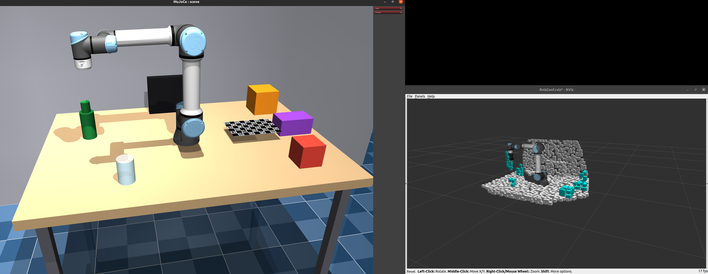
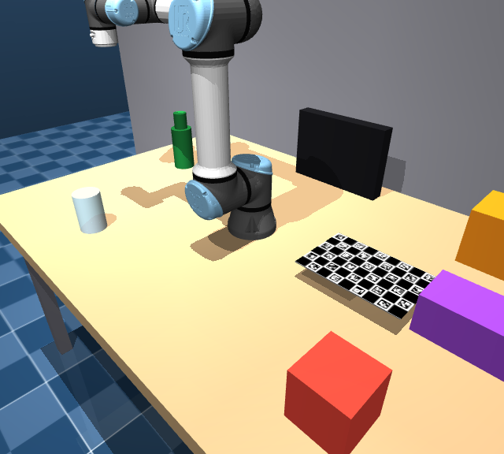
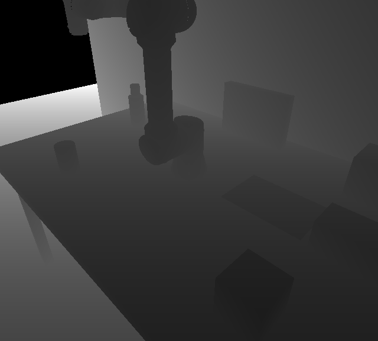

# mujoco_sim — simulated UR5e workcell for ROS 1

A MuJoCo simulation of a UR5e workcell that **impersonates the real hardware
on the same ROS topics**. Downstream consumers — a motion planner, IDMP's
distance field, `robot_state_publisher` — cannot tell whether they are
talking to this simulation or to a physical UR5e + Orbbec Femto Bolt camera.



The `/camera/color/image_raw` and `/camera/depth/image_raw` topics published
by `mujoco_ros_cell.py`, off the same camera pose as above:

| RGB (`/camera/color/image_raw`) | Depth (`/camera/depth/image_raw`) |
|---|---|
|  |  |

<div style="position: sticky; top: 0; z-index: 100; background: #000000; padding: 6px; margin: 16px 0; border-radius: 6px; display: inline-flex; flex-wrap: wrap; gap: 6px; width: fit-content;">
  <a href="#overview" style="padding: 4px 10px; border-radius: 4px; color: #e6edf3; text-decoration: none; font-weight: 600; font-size: 13px;">Overview</a>
  <a href="#ros-interface" style="padding: 4px 10px; border-radius: 4px; color: #e6edf3; text-decoration: none; font-weight: 600; font-size: 13px;">ROS interface</a>
  <a href="#repository-layout" style="padding: 4px 10px; border-radius: 4px; color: #e6edf3; text-decoration: none; font-weight: 600; font-size: 13px;">Layout</a>
  <a href="#quick-start" style="padding: 4px 10px; border-radius: 4px; color: #e6edf3; text-decoration: none; font-weight: 600; font-size: 13px;">Quick start</a>
  <a href="#1-environment-setup" style="padding: 4px 10px; border-radius: 4px; color: #e6edf3; text-decoration: none; font-weight: 600; font-size: 13px;">Setup</a>
  <a href="#2-source-commands" style="padding: 4px 10px; border-radius: 4px; color: #e6edf3; text-decoration: none; font-weight: 600; font-size: 13px;">Source commands</a>
  <a href="#3-launch-commands" style="padding: 4px 10px; border-radius: 4px; color: #e6edf3; text-decoration: none; font-weight: 600; font-size: 13px;">Launch commands</a>
  <a href="#4-where-to-change-scene-parameters" style="padding: 4px 10px; border-radius: 4px; color: #e6edf3; text-decoration: none; font-weight: 600; font-size: 13px;">Scene parameters</a>
  <a href="#5-where-geometry-math-lives-if-you-need-to-touch-it" style="padding: 4px 10px; border-radius: 4px; color: #e6edf3; text-decoration: none; font-weight: 600; font-size: 13px;">Geometry math</a>
  <a href="#6-quick-sanity-checks-after-any-scene-edit" style="padding: 4px 10px; border-radius: 4px; color: #e6edf3; text-decoration: none; font-weight: 600; font-size: 13px;">Sanity checks</a>
  <a href="#7-full-simulation-with-idmp--rmp2" style="padding: 4px 10px; border-radius: 4px; color: #e6edf3; text-decoration: none; font-weight: 600; font-size: 13px;">Full stack + IDMP</a>
</div>

## Overview

The workcell is a table (top at **z = 0**, the robot's mounting surface), a
backdrop wall, a monitor, movable tabletop clutter, a ChArUco calibration
board, and a [MuJoCo Menagerie](https://github.com/google-deepmind/mujoco_menagerie)
UR5e. An RGB-D camera watches the bench from the front-left.

The central design decision is **one world, one loop**: a single
`MjModel`/`MjData` pair is stepped by a single process, and both the fake arm
*and* the fake camera are served out of that same physics state. An earlier
design ran the arm and the camera as two separate nodes, each stepping its own
independent model — the camera never saw the arm, and its point cloud
disagreed with whatever `/joint_states` claimed at that instant.
`mujoco_ros_cell.py` exists to make that disagreement impossible.

Physics is real, not a kinematic puppet: gravity, joint constraints,
contact/friction and position-servo actuator dynamics all run through
`mj_step`, so commanded motions respect collisions and the clutter can
actually be knocked over.

Two loop rates share that one world — the robot at **125 Hz** (matching a real
UR joint-state rate) and the camera at a slower **15 Hz** by default, because
rendering two 640×576 frames every physics tick would starve the joint-state
publisher the planner depends on.

## ROS interface

Served by `scripts/mujoco_ros_cell.py`. Names and message types are copied
from the real `ur_ros_driver` and Orbbec Femto Bolt drivers, which is what
makes the impersonation work.

**Subscribed / services (in)**

| Name | Type | Role |
|---|---|---|
| `/ur_hardware_interface/start_jog` | `ur_ros_driver/StartJog` (service) | arm/disarm jogging; always reports success in sim |
| `/jog_control` | `ur_ros_driver/JogControl` | commanded joint velocity (only `feature: 1`, joint-speed jogging, is implemented) |

**Published (out)**

| Name | Type | Notes |
|---|---|---|
| `/joint_states` | `sensor_msgs/JointState` | 125 Hz, **alphabetical** joint order (see §5 — this is load-bearing) |
| `/ur_hardware_interface/tcp_pose` | `geometry_msgs/TransformStamped` | `base_link` → `tcp_link`, read from TF past the gripper |
| `/camera/color/image_raw` | `sensor_msgs/Image` | `rgb8`, 640×576 |
| `/camera/depth/image_raw` | `sensor_msgs/Image` | `16UC1`, **millimetres**, `0` = no reading (Orbbec convention) |
| `/camera/color/camera_info` | `sensor_msgs/CameraInfo` | latched; carries the *real* Orbbec intrinsics, not MuJoCo's idealised ones |
| `/camera/depth/camera_info` | `sensor_msgs/CameraInfo` | latched |
| `/tf` | `base_link` → `camera_depth_optical_frame`, `camera_color_optical_frame` | ROS optical convention (+x right, +y down, +z forward) |

The node does **not** publish a `PointCloud2` the way the real Orbbec driver
does — only the raw depth image. Downstream launch files run a
`depth_image_proc/point_cloud_xyz` nodelet to reconstruct the cloud (§7.1).

## Repository layout

```
scripts/
  scene.py               scene definition — builds + compiles the whole workcell
  mujoco_ros_cell.py     THE node: one world, arm + camera, all ROS topics
  mujoco_robot_sim.py    arm control logic (joint ordering, jog integration)
  mujoco_rgbd_node.py    camera logic (intrinsics, optical-frame flip) — import-only
  fetch_robot.py         vendors the UR5e model from MuJoCo Menagerie
assets/robots/ur5e/      vendored UR5e model, committed so a fresh clone works offline
assets/charuco/          ChArUco board texture
launch/sim.launch        node + roscore, the normal entry point
launch/idmp_demo.launch  camera → cloud → IDMP → RViz, without the planner
config/                  IDMP params + filter chain for idmp_demo.launch
docs/                    screenshots used by this README
package.xml              makes this repo rospack-discoverable as `mujoco_sim`
```

Dependency direction: `scene.py` → `mujoco_ros_cell.py`, which also imports
from `mujoco_robot_sim.py` and `mujoco_rgbd_node.py`. `scene.py` defines
*what the world contains*; `mujoco_ros_cell.py` defines *how it evolves and
gets exposed to ROS*. `scene.py` never imports `rospy`.

## Requirements

- **Ubuntu 20.04 + ROS 1 Noetic** — only needed to run the ROS node; the
  scene scripts are plain Python.
- **Python ≥ 3.10** for the scene scripts, **ROS's own Python 3.8** for the
  node (see §1 — these must not be mixed).
- A **GPU/GL context**. Headless machines need EGL (`MUJOCO_GL=egl`);
  `--viewer` switches to GLFW and needs a display.
- The **`ur_ros_driver` and `orbbec_camera` message packages** for anything
  past `--check`. These are *not* vendored here — see Known limitations.

## Quick start

```bash
git clone <this-repo> ~/Desktop/Simulation && cd ~/Desktop/Simulation
pip install -r requirements.txt

# 1. Verify the scene compiles and is physically sane (no ROS needed)
python scripts/scene.py --check

# 2. Look at it
python scripts/scene.py

# 3. Run it as a ROS node (needs ROS sourced — see §2)
export ROS_PACKAGE_PATH="$(pwd):$ROS_PACKAGE_PATH"
roslaunch mujoco_sim sim.launch
```

If step 3 fails on `ur_ros_driver` imports, that's expected — see Known
limitations. Steps 1 and 2 work standalone with no ROS at all.

## 1. Environment setup

```bash
pip install -r requirements.txt
```

Requires Python ≥3.10/3.12. Two separate Pythons exist in this project and
must not be mixed:
- **This project's Python** (≥3.10/3.12, wherever `requirements.txt` is
  installed) — runs `scene.py`, `fetch_robot.py`, and any script with
  `--check`. No ROS involved.
- **ROS 1 Noetic's system Python 3.8** (`/opt/ros/noetic/...`) — required
  only to actually run `mujoco_robot_sim.py` / `mujoco_rgbd_node.py` /
  `mujoco_ros_cell.py` as live ROS nodes (not `--check`).

## 2. Source commands

This repo is not itself a built catkin workspace — it's a pure-Python,
rospack-discoverable package (`mujoco_sim`, see `package.xml`). What you need
sourced depends on whether you're running this repo standalone or as the
backend of the full `Semantic-Obstacle-Classification-with-IDMP` stack (§7).

**Running this repo's own nodes/launch files standalone**
(`mujoco_ros_cell.py`, `roslaunch mujoco_sim sim.launch`,
`idmp_demo.launch`) — only ROS itself needs sourcing, plus this repo made
discoverable:
```bash
source /opt/ros/noetic/setup.bash
export ROS_PACKAGE_PATH="$(pwd):$ROS_PACKAGE_PATH"   # or symlink into ~/catkin_ws/src/
```

**Running the full stack** (`sim_startup.launch`, `rmp2_sim_stack.launch`,
or anything under `rmp2_ros` from the semantic-classification project) —
its own workspaces chain on top of ROS, and **must be sourced in this
order**:
```text
/opt/ros/noetic  →  utility/devel  →  rmp/devel
```
```bash
source /opt/ros/noetic/setup.bash
source ~/Desktop/Semantic-Obstacle-Classification-with-IDMP/utility/devel/setup.bash
source ~/Desktop/Semantic-Obstacle-Classification-with-IDMP/rmp/devel/setup.bash
```
Sourcing `rmp/devel` chains in `utility/devel` and `/opt/ros/noetic`
automatically in practice (each workspace's `setup.bash` sources its parent),
but sourcing all three explicitly, in order, is the safe habit — it's what
`launch_sim.sh` and this project's real-hardware equivalent both do
verbatim. This repo itself needs no separate sourcing once
`Semantic-Obstacle-Classification-with-IDMP`'s workspaces are sourced —
`mujoco_cell.sh` invokes `mujoco_ros_cell.py` directly by path (`$SIM_DIR`,
default `~/Desktop/Simulation`), not through a catkin package built from
this repo.

## 3. Launch commands

### 3.1 `scene.py` — build/inspect/view the workcell (no ROS)

```bash
python scripts/scene.py                  # compile + open interactive viewer
python scripts/scene.py --check          # compile, print stats + run self-tests, no window
python scripts/scene.py --no-robot       # workcell without the UR5e included
```

Viewer keybinding: **`E`** toggles "environment only" rendering — hides the
movable clutter (glass, bottle, blocks, ChArUco board) but keeps the table,
wall, monitor, floor, *and the robot itself* visible.

### 3.2 `fetch_robot.py` — vendor/update the UR5e model

```bash
python scripts/fetch_robot.py            # sparse-clone from Menagerie, overwrite assets/robots/ur5e/
python scripts/fetch_robot.py --check    # verify the already-vendored model compiles, no network
```

### 3.3 `mujoco_robot_sim.py` / `mujoco_rgbd_node.py` — component logic

`mujoco_robot_sim.py` is still independently runnable and has its own
self-test, kept as the reference implementation for arm control (joint
ordering, actuator integration):

```bash
python3 scripts/mujoco_robot_sim.py --check    # joint-ordering + jog-integration proofs
python3 scripts/mujoco_robot_sim.py            # standalone ROS node (superseded by mujoco_ros_cell.py)
```

`mujoco_rgbd_node.py` is **not** independently runnable — it has no `main()`
or `__main__` block. It exists purely as an imported library of functions
(`render_rgbd`, `mujoco_cam_to_ros_optical`, `mat_to_quat`,
`make_camera_info`, the `ORBBEC` intrinsics) that `mujoco_ros_cell.py`
imports and drives. Its correctness is exercised indirectly through
`mujoco_ros_cell.py --check` (§3.4) and `mujoco_robot_sim.py --check` (which
imports `mat_to_quat` from it).

### 3.4 `mujoco_ros_cell.py` — the node that actually runs

```bash
python3 scripts/mujoco_ros_cell.py --check              # verify everything, no roscore needed
python3 scripts/mujoco_ros_cell.py                       # publish to ROS (needs roscore running)
python3 scripts/mujoco_ros_cell.py --viewer               # same, plus an interactive window
```

ROS params (set with `_name:=value` on `rosrun`, or `<param>` in a launch
file):

| param | default | effect |
|---|---|---|
| `~camera_rate` | `15.0` Hz | how often the camera renders/publishes (robot loop is fixed at 125 Hz) |
| `~env_only` | `false` | if true, published camera images hide clutter (arm + environment stay visible) — fixed at startup, no live toggle |

```bash
rosrun mujoco_sim mujoco_ros_cell.py _camera_rate:=30 _env_only:=true
```

Note: `~env_only` is not currently exposed as a `sim.launch` arg (see below)
— only reachable via `rosrun` or by adding a `<param name="env_only" .../>`
to the launch file yourself.

### 3.5 `roslaunch` — the normal way to bring the whole thing up

```bash
roslaunch mujoco_sim sim.launch                     # node + roscore, viewer on, camera at 15 Hz
roslaunch mujoco_sim sim.launch viewer:=false        # headless, topics still publish
roslaunch mujoco_sim sim.launch camera_rate:=30      # faster camera
```

Requires this repo to be discoverable by rospack — either:
```bash
ln -s /path/to/this/repo ~/catkin_ws/src/mujoco_sim
# or
export ROS_PACKAGE_PATH="$(pwd):$ROS_PACKAGE_PATH"
```
Also requires ROS's own Python and the `ur_ros_driver` / `orbbec_camera`
message packages, which are **not yet present** in this workspace — the node
will fail past `--check` until those are installed.

## 4. Where to change scene parameters

Everything below lives in **`scripts/scene.py`**. Nothing needs touching in
`mujoco_ros_cell.py` or the ROS nodes to change the scene itself — they just
call `compile_scene_model()`.

### 4.1 Table size

```python
TABLE_LENGTH = 1.60      # along x
TABLE_WIDTH = 1.10       # along y
TABLE_HEIGHT = 0.75      # floor to top surface
SLAB_THICKNESS = 0.05
LEG_THICKNESS = 0.05
LEG_INSET = 0.08
```
Table top is always z = 0 — changing `TABLE_HEIGHT` moves the floor, not the
top surface.

### 4.2 Backdrop wall

```python
WALL_GAP = 0.05          # clearance behind the table's far edge
WALL_THICKNESS = 0.05
WALL_HEIGHT = 2.0         # measured up from the FLOOR
WALL_MARGIN_X = 1.0       # extra width past each end of the table
```

### 4.3 Depth camera pose / field of view

```python
CAMERA_POS = (0.75, -0.75, 0.65)
CAMERA_FOVY = 58
```
`camera_fovy` is also overridable at compile time via
`compile_scene_model(camera_fovy=...)` — `mujoco_ros_cell.py` overrides it to
match the Orbbec's derived FOV automatically, so editing `CAMERA_FOVY` here
only changes `scene.py`'s own standalone viewer default.

### 4.4 Adding/removing/moving clutter objects

**Blocks** — a list, so adding/removing one is adding/removing a dict entry:
```python
BLOCK_SPECS = [
    dict(name="block_small", half=(0.060, 0.060, 0.060),
         pos_xy=(0.55, -0.35), rgba="0.85 0.25 0.20 1"),
    dict(name="block_medium", half=(0.080, 0.080, 0.080),
         pos_xy=(0.60, 0.35), rgba="0.95 0.55 0.10 1"),
    dict(name="block_flat", half=(0.100, 0.060, 0.050),
         pos_xy=(0.65, 0.0), rgba="0.55 0.25 0.75 1"),
]
```
`half` = half-extents, so a box's rendered size is **twice** these numbers —
the single most common MJCF mistake. `pos_xy` is where it rests on the table;
z is computed automatically so its bottom face sits exactly at z = 0.

**Glass / bottle** — single-object constants, not a list:
```python
GLASS_RADIUS = 0.040
GLASS_HALF_HEIGHT = 0.060
GLASS_POS_XY = (-0.35, -0.35)
GLASS_RGBA = "0.75 0.90 1.00 0.55"

BOTTLE_BODY_RADIUS = 0.040
BOTTLE_BODY_HALF_HEIGHT = 0.080
BOTTLE_NECK_RADIUS = 0.025
BOTTLE_NECK_HALF_HEIGHT = 0.030
BOTTLE_POS_XY = (-0.55, 0.15)
BOTTLE_RGBA = "0.10 0.45 0.20 1"
```
To add a genuinely new *kind* of object (not just another
block), copy the `<body>...</body>` block for `glass` or `bottle` inside
`build_scene_xml()` as a template, give it a unique name and
`<freejoint/>` if it should be movable, and put it in `group="{GROUP_CLUTTER}"`.

**Important constraint (from the code comments):** every clutter object's
smallest dimension must stay **≥ 0.04 m** — anything thinner disappears when
voxelized for downstream distance-field processing.

**If you add or remove any free-body clutter object**, you must also update
the `free_body_home` list inside `build_scene_xml()` — it
builds the scene's `"home"` keyframe, and its qpos entries must exactly match
the free bodies actually declared, in declaration order, or the model will
fail to compile ("expected length N, got M").

### 4.5 Monitor (static — grouped with environment, not clutter)

```python
MONITOR_HALF_X = 0.175
MONITOR_HALF_Y = 0.025
MONITOR_HALF_Z = 0.125
MONITOR_POS_XY = (0.0, 0.45)
MONITOR_RGBA = "0.08 0.08 0.09 1"
```

### 4.6 ChArUco calibration board

```python
BOARD_SQUARES_X = 6
BOARD_SQUARES_Y = 9
BOARD_SQUARE_SIZE = 0.032
BOARD_POS = (0.395, 0.0, 0.047)
BOARD_QUAT_WXYZ = (0.0, 0.7071067811865476, 0.7071067811865475, 0.0)
```
**Do not "fix" this pose casually** — it's copied verbatim
from the real rig's calibration file, not derived geometrically.

### 4.7 Robot home pose

Two places have to agree if you change this:
- `scripts/scene.py`: `HOME_QPOS_ROBOT = "-1.5708 -1.5708 1.5708 -1.5708 -1.5708 0"`
- `scripts/mujoco_ros_cell.py`: `HOME_QPOS_NATIVE = [0.0, -1.57, 1.57, -1.57, -1.57, -1.57]`

These are two *different* poses today (the cell's node seeds its own value
directly rather than reading the scene's keyframe — see that file's
docstring for why). Change whichever one actually drives the behavior you
care about: `scene.py`'s value only affects `scene.py`'s own standalone
viewer/`--check`; `mujoco_ros_cell.py`'s value is what the live ROS node
actually starts at.

### 4.8 Turning the robot on/off entirely

```python
compile_scene_model(include_robot=False)   # in code
python scripts/scene.py --no-robot         # from the CLI
```

### 4.9 Environment-only visibility (clutter hidden, robot + env shown)

```python
GROUP_ENV = 0
GROUP_CLUTTER = 1
GROUP_ROBOT_VISUAL = 2
```
Controlled by `apply_environment_only(scene_option, env_only)`
— call this on any `MjvOption` (a live viewer's `.opt`, or one passed to
`mujoco.Renderer.update_scene`). If you want to hide the robot too, add
`GROUP_ROBOT_VISUAL` to the exclusion set inside `apply_environment_only`
instead of the inclusion set.

## 5. Where geometry math lives, if you need to touch it

- **Table legs**: `_legs_xml()` in `scripts/scene.py`
- **Block clutter**: `_blocks_xml()` in `scripts/scene.py`
- **Full XML assembly**: `build_scene_xml()` in `scripts/scene.py`
- **Compiling (meshdir/keyframe workarounds)**: `_compile_model()` in `scripts/scene.py`
- **Camera intrinsics (fx/fy/cx/cy ↔ MuJoCo fovy)**: `Intrinsics` class + `ORBBEC` instance in `scripts/mujoco_rgbd_node.py`
- **Joint name ordering (native vs. published)**: top of `scripts/mujoco_robot_sim.py`
- **Robot control law (velocity → position-servo target)**: `step_jog()` in `scripts/mujoco_robot_sim.py`

## 6. Quick sanity checks after any scene edit

```bash
python scripts/scene.py --check
```
Confirms: compiles, clutter starts resting exactly at z = 0.000, robot
joints/actuators/home-keyframe all present, end-effector above the table,
and clutter survives 300 physics steps without sinking or exploding.

```bash
python3 scripts/mujoco_ros_cell.py --check
```
Confirms all of the above plus: home-pose seeding is correct (zero commanded
velocity holds position, nonzero velocity actually moves the arm), and one
full camera render succeeds with env-only masking visibly changing the
output.

## 7. Full simulation with IDMP + RMP2

This repo is only the physics/rendering backend. The full pipeline — this
sim feeding IDMP's voxel occupancy map, feeding the RMP2 motion planner —
lives in the separate **`Semantic-Obstacle-Classification-with-IDMP`**
project, in its `rmp` catkin workspace, package `rmp2_ros`. Its
`scripts/simulation/mujoco_cell.sh` wrapper is what actually launches this
repo's `mujoco_ros_cell.py`:
```bash
exec env MUJOCO_GL=egl python3 "${SIM_DIR:-$HOME/Desktop/Simulation}/scripts/mujoco_ros_cell.py" "$@"
```
So as long as this repo lives at `~/Desktop/Simulation` (the default), no
extra configuration is needed — otherwise pass `sim_dir:=` (see below) or
export `SIM_DIR`.

Three launch files, in `rmp/src/rmp2_ros/launch/simulation/`, cover the three
stages of actually using it:

### 7.1 `sim_startup.launch` — the sim-side entry point (one cell, no planner)

```bash
roslaunch rmp2_ros sim_startup.launch
```
Starts, in order: this repo's `mujoco_ros_cell.py` (arm + camera), a
`robot_state_publisher` node (feeding off `/joint_states`, publishing the TF
tree exactly as it would on real hardware), a `depth_image_proc` nodelet
(rebuilds `/camera/depth/points` from the raw depth image — the real Orbbec
driver publishes a point cloud directly, this sim node only publishes depth,
so this step exists only in the sim path), the crop/voxel filter chain, an
`env_subtract` node, IDMP itself, RViz, and a trajectory server.

**A MuJoCo viewer window opens by default** — no extra arg needed. Any run of
this file publishes the camera topics, so `mujoco_cell.sh` is passed
`--viewer` by default; pass `viewer:=false` for a headless run (e.g. while
scripting `capture_env_sim.launch`, or in CI).

Args:

| arg | default | effect |
|---|---|---|
| `sim_dir` | `$HOME/Desktop/Simulation` | path to this repo, passed through as `SIM_DIR` |
| `viewer` | `true` | open the MuJoCo viewer window (see above); `false` for headless |
| `env_pcd` | `environment_cloud_sim.pcd` | path to a captured static-environment `.pcd` to subtract (see §7.2) — until that file has actually been captured, `env_subtract` logs one error and passes clouds through unfiltered |
| `camera_rate` | `15` | forwarded straight to `mujoco_ros_cell.py`'s `~camera_rate` |
| `env_only` | `false` | forwarded straight to `mujoco_ros_cell.py`'s `~env_only` — set `true` only when capturing the environment cloud (§7.2) |
| `filter_chain` | `idmp_ros/config/cameraFilterChain_sim.yaml` | crop/voxel filter chain config — a **separate file** from the real cell's `cameraFilterChain.yaml` (see §7.5) |

```bash
roslaunch rmp2_ros sim_startup.launch camera_rate:=30 env_pcd:=$(rospack find idmp_ros)/config/environment_cloud_sim.pcd
roslaunch rmp2_ros sim_startup.launch viewer:=false     # headless
```

This file is deliberately **not** connected to `Simulation/launch/sim.launch`
or `idmp_demo.launch` — it's a separate, self-contained launch tree so the
real-hardware launch files stay untouched and unaware simulation exists (and
vice versa). If you retune the filter chain or IDMP params for the real
cell, you must retune this file's copies by hand too — they are copied, not
shared.

### 7.2 `capture_env_sim.launch` — capture the static background once

Before subtracting the empty workcell (table/wall/monitor/floor) from every
frame, you need a one-time capture of what it looks like with nothing moving
in it. Order of operations:

```bash
# terminal 1 — bring the sim up with ONLY the environment visible
roslaunch rmp2_ros sim_startup.launch env_only:=true

# terminal 2 — capture 30 frames off the live filtered cloud
roslaunch rmp2_ros capture_env_sim.launch
```
Writes to `idmp_ros/config/environment_cloud_sim.pcd` by default (override
with `output:=`). This is a **separate file** from the real cell's
`environment_cloud_merge.pcd` — sim and hardware have different geometry and
must never share a capture.

Afterwards, point normal runs at it:
```bash
roslaunch rmp2_ros sim_startup.launch env_pcd:=$(rospack find idmp_ros)/config/environment_cloud_sim.pcd
```

### 7.3 `rmp2_sim_stack.launch` — the full staged stack (sim + IDMP + planner)

```bash
roslaunch rmp2_ros rmp2_sim_stack.launch
```
This is the simulation counterpart of the real-hardware tmux stack
(`rmp2_full_stack.launch`). It opens one tmux session (`rmp2_sim` by
default) with 4 panes, staged with delays so each component comes up only
once its dependencies are ready:

| pane | starts | delay |
|---|---|---|
| 0 | `roslaunch rmp2_ros sim_startup.launch` (§7.1 — the sim + IDMP chain) | immediate |
| 1 | `rosrun idmp_ros queryTool.py` | `d1` (default 30s) |
| 2 | `rosrun rmp2_ros node.py` (the RMP2 planner) | `d2` (default 60s) |
| 3 | `rosrun rmp2_ros goal_node.py` | `d3` (default 90s) |

Args: `session_name` (tmux session name), `delay_step` (seconds between each
stage — `d1`/`d2`/`d3` default to `1×`, `2×`, `3×` this value).

```bash
roslaunch rmp2_ros rmp2_sim_stack.launch delay_step:=20
tmux attach -t rmp2_sim     # if it started detached (non-interactive shell)
```

### 7.4 Quick alternative: this repo's own `idmp_demo.launch`

For just watching IDMP's voxel map update against the sim without the RMP2
planner, tmux staging, or env-subtraction, this repo has its own simpler
chain at `launch/idmp_demo.launch`:
```bash
roslaunch mujoco_sim idmp_demo.launch
roslaunch mujoco_sim idmp_demo.launch viewer:=false rviz:=false
```
This is a lighter-weight path (camera → point cloud → IDMP filter chain →
IDMP → RViz only) — use §7.1–7.3 when you actually need the planner or
environment subtraction in the loop.

### 7.5 Troubleshooting

**Crop box too large / clutter (or everything) surviving the filter chain.**
The sim and the real cell each have their **own separate** crop-box config
now, so retuning one never affects the other:

| Cell | File | Referenced by |
|---|---|---|
| Sim | `IDMP/config/cameraFilterChain_sim.yaml` | `sim_startup.launch`'s `filter_chain` arg |
| Real | `IDMP/config/cameraFilterChain.yaml` | `camera_startup.launch`'s `filter_chain` arg |

The sim file's `CropBoxFilter` is sized for *this* sim's table (1.60×1.10 m,
top at z=0): `x:[-1.2,1.2] y:[-0.7,0.58] z:[-0.05,1.0]`. `max_y=0.58`
deliberately sits just inside the backdrop wall's near face (wall starts at
y≈0.60) so the wall gets cropped along with the floor. If you resize the
table in `scene.py` (§4.1), retune the sim file's box to match — it will not
resize itself. The real file's crop box is unchanged from the repo's
original (a much wider, real-bench-sized box, with a small tighter
alternative kept as a commented-out block) — retune it there only if you're
actually working on the real cell. Only the crop box differs between the two
files by design — `VoxelGridFilter` and `robot_body_filter_containment` are
identical in both;
if you retune those, update both files by hand.

**Robot appears rotated in RViz (and/or `robot_body_filter` eats real
clutter points along with it).** These two are almost certainly the same
bug: `robot_body_filter` removes cloud points by testing containment against
the robot's TF-driven inflated mesh — if that mesh is misregistered, it can
just as easily eat real object points that happen to fall inside the
phantom, wrongly-placed volume as it fails to eat the actual robot points.

The two well-known UR5e/ROS frame-convention corrections in this stack
(MuJoCo's own `<body name="base" quat="0 0 0 -1">` in `ur5e.xml`, and real
`ur_description`'s `base_link → base_link_inertia` fixed joint) already
cancel each other out correctly — that is **not** the bug, verified by
reading both files. If the whole arm looks rotated ~180° about the vertical
axis relative to the point cloud (not individual joints bent wrong), the
remaining suspect is `scene.py`'s table/camera layout: it was authored in an
arbitrary MuJoCo world frame that was never cross-checked against which way
the real UR5e's true `base_link` +X actually points.

`scripts/mujoco_ros_cell.py` has a `WORLD_YAW_180_Z` toggle (near
`HOME_QPOS_NATIVE`) that re-expresses the camera's TF as though the world
were yawed 180° about Z before being called `base_link` — it only touches
the camera TF, never the arm (which `robot_state_publisher` renders purely
from `/joint_states` + the URDF, untouched by MuJoCo's raw world
coordinates). It defaults to `True`. **This is an unverified hypothesis
fix** — if it makes the RViz mismatch worse instead of better, set it back
to `False`; the true error is a different axis/angle and needs fresh
diagnosis (start with `rosrun tf tf_echo base_link camera_depth_optical_frame`
while the sim runs, and compare the printed rotation against what you'd
expect for the camera's known pose in `scene.py`).

## Known limitations

Honest list of what this sim does *not* reproduce, and what is still open.

**Missing dependencies**
- The `ur_ros_driver` and `orbbec_camera` message packages are not present in
  this workspace. Everything with `--check` works without them (the imports
  are deliberately lazy), but actually starting the node needs them.

**Sim-to-real gaps**
- **No gripper in the MuJoCo model.** There is no Robotiq Hand-E body, so the
  model itself cannot report `tcp_link` (~65 mm past the flange). The node
  asks TF for it instead, so the offset lives once in the URDF — but if
  `robot_state_publisher` isn't up yet, it falls back to the bare flange and
  is wrong by that ~65 mm until TF arrives (it warns once when this happens).
- **Camera intrinsics are nominal, not measured.** `ORBBEC` in
  `mujoco_rgbd_node.py` uses the Femto Bolt's NFOV-unbinned spec values, not
  numbers read off the actual device. Replace them by running the real driver
  and copying `K` from `/camera/depth/camera_info`.
- **MuJoCo is an ideal pinhole camera**: principal point is always the image
  centre, pixels are always square (`fx == fy`), and there is no lens
  distortion at all. `CameraInfo` still publishes the *real* asymmetric
  intrinsics, because that is what consumers calibrate against — the residual
  mismatch is the honest sim-to-real gap, and `mujoco_rgbd_node.py`'s
  `Intrinsics.mujoco_equivalent()` quantifies it.
- **`effort` in `/joint_states` is not a force/torque measurement.** It's
  `data.qfrc_actuator`, the actuator's own applied generalised force — a
  reasonable proxy, not a simulated sensor with noise or bandwidth limits.
- **No depth noise model.** Depth is geometrically exact, with none of a real
  depth sensor's noise, dropouts, or edge artifacts.

**Open issues**
- `WORLD_YAW_180_Z` in `mujoco_ros_cell.py` is an **unverified hypothesis
  fix** for a ~180° yaw mismatch seen in RViz (§7.5). It defaults to `True`
  and needs a live check.
- `smoke_test.py` is broken — it calls `mujoco.viewer.launch()`, which no-ops
  silently. Use `launch_passive()` with a manual stepping loop instead, as
  every script in `scripts/` does.
- There is no lint or test framework. Each module's `--check` flag *is* the
  test suite (§6).

## Credits

The UR5e model in `assets/robots/ur5e/` is vendored from
[MuJoCo Menagerie](https://github.com/google-deepmind/mujoco_menagerie)
(see its own `LICENSE` and `PROVENANCE.md` in that directory for the upstream
commit it came from). Re-fetch or update it with `python scripts/fetch_robot.py`.
